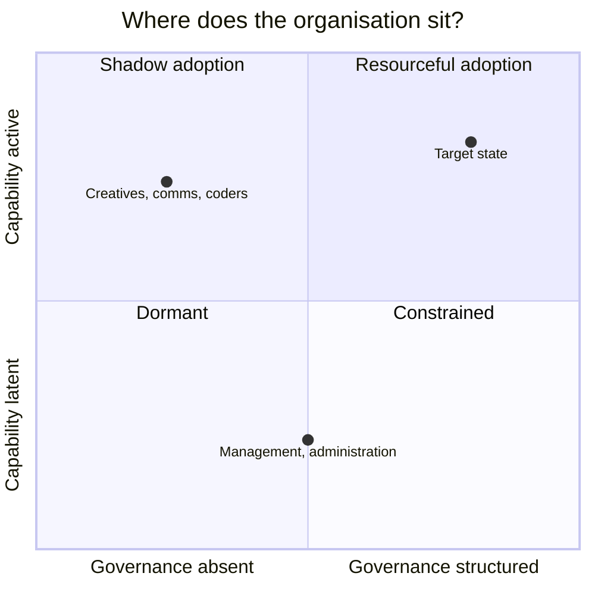
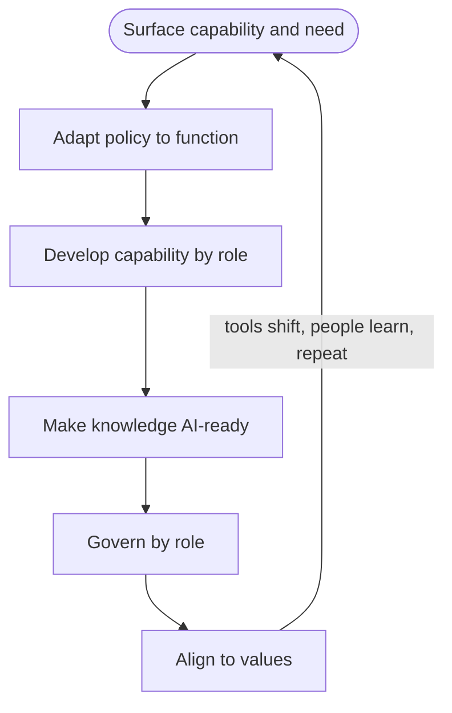

*Governing AI across the organisation, and protecting integrity where it counts most: the editorial chain.*

Most organisations are told to approach AI from the top down: identify the dangers, standardise on a single corporate tool, and route every decision through central IT. This is governance-by-restriction. It is also, in most organisations, a fiction, because the capability it claims to install already exists, informally, among the staff who use these tools every day.

This framework inverts the conventional approach. It begins not with risk but with **existing capability**: who is already using AI well, for what, and to what effect. Governance is then built *around* that capability rather than in place of it. The job of leadership is not to install competence but to surface, preserve, and steward the competence already present, and to do so before the gap between practice and policy becomes a liability.

This is the solution-focused move applied to organisational change. It starts from resources and exceptions ("what is already working") rather than deficits ("what could go wrong"). The two are not opposed (risk is governed), but the order matters, and the order is the differentiator.

## The premise

Three observations hold across NGOs, corporates, and public bodies alike:

1. **Capability is already distributed.** Staff adopt AI faster than organisations can write policy for it. The useful expertise is not in the IT department; it is in the functions, among the people doing the work.
2. **The pace of change outruns governance.** Any technology dependent on computing capability will tend to outpace the strategy, governance and policy formed to manage it. Policy that assumes a stable tool landscape is obsolete on arrival.
3. **A single general-purpose tool cannot serve every specialist role.** Defaulting to one corporate assistant standardises the lowest-risk cases while quietly degrading effectiveness for the specialists who create the most value.

The consequence: the real risk is not that staff use AI. It is that they use it *ungoverned and unseen*, and that the organisation responds by suppressing the capability rather than harnessing it.

## The diagnostic

Two variables describe where any organisation actually sits: how **active** its AI capability is, and how **structured** its governance is.

- **Dormant**: little use, little policy. Low risk, but also forgoing the gains and falling behind.
- **Shadow adoption**: active, capable use with no governance wrapped around it. *This is where most organisations actually are.* High value being created, high exposure, invisible to leadership.
- **Constrained**: heavy policy, suppressed capability. The failure mode of top-down consulting: compliant, governed, and quietly less effective than the day before.
- **Resourceful adoption**: the target. Capability is active *and* governed: surfaced, supported, and bounded by clear policy.

The diagnostic reframes the work. The task is rarely to *create* capability (the Dormant assumption) and rarely to *restrict* it (the Constrained reflex). It is to move from Shadow to Resourceful: to govern what is already happening without killing what already works.

Read this per team, not for the organisation as a whole. Most teams cluster in Dormant or Constrained, with latent capability and access limited to mandated tools. A few sit in Shadow: high capability, governance absent or waving it through. The high-value move is to find those Shadow pockets and bring them to Resourceful, concentrating flexibility where competence already exists rather than spreading it evenly. The line is not permanent; teams that build competence graduate into the same approach over time. In a small organisation that is effectively one capable team on one floor, the distinction collapses and the whole organisation is the pocket.

## The operating model

Moving a team from Shadow to Resourceful is not a one-time project but a continuous cycle. It begins by surfacing the capability already present, runs through five domains, and returns to the start. Two things keep it turning: the tool landscape resets every few months, and capability compounds as people learn, so each pass surfaces more than the last. Resourceful adoption is not a finish line. It is the condition of keeping the cycle turning.

**1. Policy that adapts, not imposes.** Policy works best built on the baseline that already exists and extended to the realities of each function, rather than one rule written for all.

**2. Develop capability by role, not by broadcast.** Surfacing reveals not just what people do with AI but what each of them needs to learn next, and the needs differ: data protection for one, how generative models actually work for another, bias and disclosure for a third, the technical edges for a few. Matched to the person and met, that need becomes the engine that compounds capability. Champions close to the work are the far end of this, not the whole of it.

**3. AI-ready knowledge.** AI is only as useful as the institutional knowledge it can reach. Structured, accessible information is the precondition for value, not an afterthought.

**4. Govern by role, on a fixed floor.** Underneath everything sits a base layer that is not negotiable: IT for security, infrastructure and data handling, legal for data protection, liability and contracts. Keep it as thin as the law and security genuinely require. Above it, govern by role: what each role may do, must disclose, and is accountable for, calibrated to competence rather than applied uniformly. A floor that grows too thick is how an organisation ends up Constrained.

**5. Values alignment.** For mission-led and faith-based organisations especially, vendor choice and deployment decisions are read through an ethical lens. Alignment is a governance input, not a PR exercise.

This framework asks many questions and answers few of them for you. It makes one recommendation. Build the base layer that law and security require, keep it no thicker than that, and let everything above it be role-based and flexible. The rest of the document is a way of working out what that flexible layer should hold.

## The lenses

Each domain is examined through five recurring lenses. Every lens carries both an opportunity and a paired risk, and the framework refuses to treat them separately, because in practice they arrive together. ~~These lenses are also where the supporting articles live.~~ The integrity lens carries the most weight for values-led organisations, and is examined in full below.

| Lens | Opportunity | Paired risk |
| --- | --- | --- |
| Productivity & efficiency | Faster routine knowledge work | Over-reliance, deskilling |
| Knowledge & research | Faster analysis at scale | Unsourced, unverifiable output |
| Communications & audience | Sharper messaging, real insight | Synthetic media, narrative drift |
| Integrity | Trust preserved | Bias, privacy, synthetic media |
| Workforce | Augmentation, new capability | Role erosion without policy |

> Integrity is where responsible adoption is won or lost. Bias, data privacy, synthetic media and reputational exposure are the risks most leaders sense but find hardest to govern. It is the point where "responsible" stops being a label and becomes a practice.

## The editorial chain

For most values-led organisations there is one pocket where this framework bites first: the comms or publishing function. It is the highest-leverage target for a specific reason. It is simultaneously the highest-capability pocket and the highest-risk one, because it publishes externally. The value being created and the reputational exposure sit in the same team. Credibility rests almost entirely on what the organisation publishes, and the voice is the asset. That makes the editorial chain, from first draft to final sign-off, where the integrity lens stops being abstract. Three pressures make it urgent.

**Reputational exposure is asymmetric.** A commercial brand can absorb the odd synthetic misstep. An organisation whose authority rests on trust cannot. Careless or undisclosed AI use does not just produce a weak asset; it puts the organisation's honesty in question, which is far harder to repair than a single error.

**Degradation is a risk worth watching, not a certainty.** Used well, AI does not flatten a house voice. The narrower risk is that cost pressure is allowed to remove human writers altogether, taking with them the people whose job is to notice a drifting voice or a fluent-sounding error. AI does not degrade quality on its own; thinning the human layer too far is what does.

**AI in the chain is necessary, not exceptional.** Tweaking an image, cutting a draft to length, smoothing a translation: AI is now woven into ordinary editorial tasks, and forbidding it is neither realistic nor desirable. The governance question is not whether AI is used, but where the lines fall and how use is disclosed. A policy that treats AI as an exception to be stamped out will simply be ignored.

> The window for detecting AI in published work is closing. As models improve, AI-shaped text and images will grow harder to tell from human work, not easier. A standard that leans on spotting AI after publication will not hold for long, which points the real control toward creation and sign-off rather than detection.

**Underneath all of this sits a question of trust.** We are moving into a world where it is getting harder to know whether what we read or see was made by a person, means what it says, or refers to anything real at all. As that uncertainty grows, audiences fall back on a simpler question: do I trust the source? For an organisation whose authority rests on pointing to something it holds to be genuinely true, that question is the whole game. Seen this way, editorial integrity is less a set of rules than the way an organisation keeps its word about what is real.

**Defining nominal use.** Not all AI use carries the same weight. One workable way to draw the line separates routine, low-risk assistance from uses that fabricate content or stand in for human judgement. Three common cases:

- *Photo editing.* Routine correction (crop, exposure, colour) is nominal. The line is whether a change alters editorial content, meaning what the image asserts as true, which forces a careful judgement about what in a given image is editorial and what is merely presentation. Where an edit touches editorial content, transparency wins: disclose it rather than rely on it passing unnoticed.
- *Translation.* Unsupervised machine translation is already routine online, so the real question is transparency, not whether a human checked every line. Nominal use means disclosing that a text was machine-translated; the failure is presenting it as an authoritative human rendering when meaning or nuance may have shifted.
- *Drafting copy.* AI as a drafting aid, with a named human who revises and owns the result, is nominal. Publishing AI-generated copy unedited is not, because no human has taken authorship.

The thread through all three is the same: AI assists, but authorship, accountability and disclosure stay with people. Exactly where each line falls is for the organisation to settle. That the lines exist, and get decided rather than drifted into, is the point.

**Two kinds of human involvement, easily confused.** Being involved during the work is not the same as signing off at the end. Involvement during creation shapes quality. A clear point of human accountability for the published piece, a named person who has seen it as it goes out, is what protects integrity. Organisations tend to have the first and assume it covers the second. Where the line between them falls, and who carries the final accountability, is one of the more revealing questions this framework surfaces.

**The question of going public.** Often the most powerful move available is also the simplest: to state publicly how the organisation uses AI in its editorial chain, what is permitted, and where a person signs off. That opens a real choice. Disclosure can sit once at the policy level, as a standing statement covering all output, or per item, on individual pieces. The first is lighter and more durable; the second is more precise but harder to sustain. Which fits depends on the organisation, and is worth deciding deliberately rather than by default. Either way, transparency here reads less as a disclaimer than as the organisation living out, in public, the values it already holds.

## How to use this framework

Start with the diagnostic. Locate honestly where your organisation sits today, from dormant or shadow use through to governed adoption. That single judgement reframes everything that follows, because the work needed to move out of shadow use is not the work needed to escape over-restriction. From there, name the move and run the cycle, beginning with what is already working rather than what is missing.

The framework is a lens, not a checklist. It will show you where you are and what to do next. What it cannot do from the page is the harder part: surfacing the capability genuinely present in your functions, adapting policy to your real constraints, and setting boundaries that hold inside your particular institution. That judgement is specific to each organisation, and it is where the real work begins.